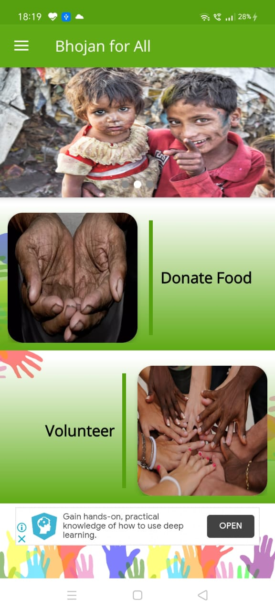
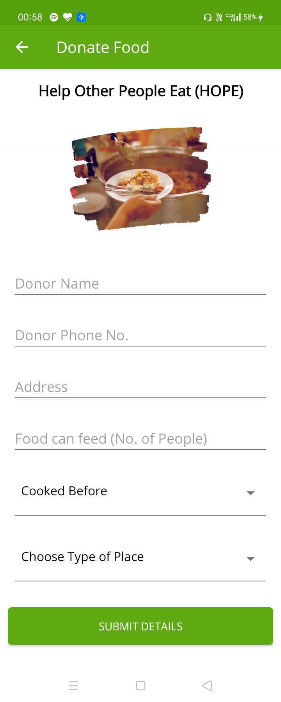
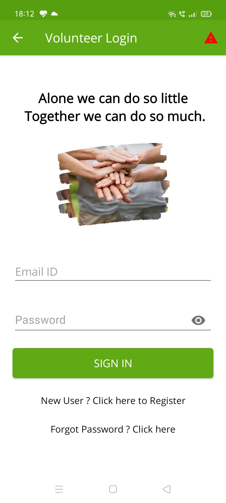
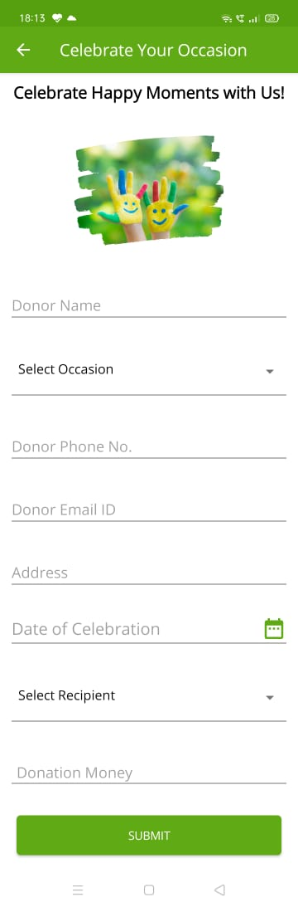
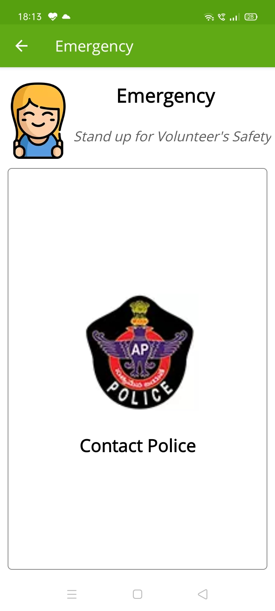
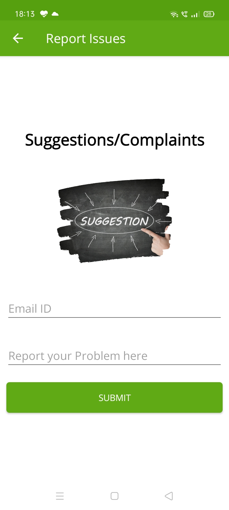

<h1 align="center" style="border-bottom: none">
    <b>
        <a href="https://www.google.com"> Food Waste Management </a><br>
    </b>    
</h1>

# [`Demo video link `](https://drive.google.com/drive/folders/1CSCZJypJfVJb_ENoe6e9bOjwd8B0meAs) 
Food waste management is the systematic approach to handling and repurposing food waste to mitigate its environmental impact and maximize resource efficiency. It involves strategies aimed at prevention, reduction, recovery, and recycling of food waste at various stages of the food supply chain. Prevention measures focus on minimizing waste generation through better inventory management and consumer education. Reduction efforts seek to minimize waste through donation programs and improved storage practices. Recovery initiatives divert food waste from landfills, with options including composting and anaerobic digestion. Recycling involves transforming food waste into new products or materials, such as biofuels or animal feed. By implementing effective food waste management strategies, societies can reduce environmental degradation, conserve resources, and address food insecurity while promoting a more sustainable and circular economy.
## Team Details
`Team number` : VH108

| Name    | Email           |
|---------|-----------------|
| Ch. Manikanta Reddy | 99210041023@klu.ac.in |
| P.Subramanyam | 99210041751@klu.ac.in |
| B. Anil Kumar | 9921004091@klu.ac.in |
| P.Nithin | 99210041106@klu.ac.in |

<div style="display: flex; flex-wrap: wrap;">
   <table>
 
 <tr>
   <td width="33.3%">&nbsp;</td>
   <td width="33.33%">&nbsp;</td>
   <td width="33.33%">&nbsp;</td>
 </tr>
 <tr>
   <td align="center">Home Page</td>
   <td align="center">Food Donation Page</td>
   <td align="center">Volunteer Login </td>
 </tr>
 
 <tr>
   <td width="33.3%">&nbsp;</td>
   <td width="33.33%">&nbsp;</td>
   <td width="33.33%">&nbsp;</td>
 </tr>
 <tr>
   <td align="center">Celebrate Occassion</td>
   <td align="center">Emergency for Volunteers</td>
   <td align="center">Report Issues</td>
 </tr>
  
</table>

<br/>

</div>

## Problem statement 
Food wastage: Hotels, restaurants, and households often discard excess food, contributing to environmental waste.
Food insecurity: Many individuals, particularly those in poverty, struggle to access an adequate and nutritious diet due to financial constraints.
Severity of the problem:

Food wastage not only leads to environmental degradation but also highlights inefficiencies in the food distribution system.
Food insecurity results in malnutrition and health issues among vulnerable populations, exacerbating societal inequalities.
Why we need a solution:

Redistributing surplus food to those in need reduces wastage, addresses food insecurity, and promotes sustainability.
Efficient food redistribution channels can bridge the gap between surplus food and disadvantaged communities, ensuring equitable access to nutrition.
Group of people affected:

Low-income individuals and families who lack the financial means to afford sufficient food are most affected by both food wastage and insecurity.## About the project
mention few details and features of the project , how it is solving the problem 

## About the project
The app serves as a platform connecting food donors (hotels, restaurants, households) with organizations and individuals in need.
It allows donors to upload information about surplus food items, including quantity, type, and expiration date.
Recipient organizations and individuals can browse available donations based on their location and food preferences.
The app facilitates communication between donors and recipients, allowing for seamless coordination of food pickups and deliveries.
It may include features for tracking donations, generating reports, and providing feedback to users.
Features of the Project:

User Profiles: Donors and recipients can create profiles with relevant information such as location, preferences, and contact details.
Donation Listings: Donors can list surplus food items with details such as quantity, type, and expiration date, making it easy for recipients to find suitable donations.
Search and Filter: Recipients can search for donations based on location, type of food, and availability, streamlining the process of finding relevant donations.
Real-Time Notifications: Both donors and recipients receive notifications about new donations, messages, and pickup/delivery requests, ensuring timely communication.
Pickup/Delivery Coordination: The app provides tools for scheduling and coordinating food pickups or deliveries between donors and recipients, optimizing logistics.
Feedback and Ratings: Users can provide feedback and ratings based on their experience with donations and interactions, fostering trust and accountability within the community.
Analytics and Reporting: The app may offer analytics and reporting features for tracking donation trends, food distribution impact, and user engagement, enabling continuous improvement and transparency.
How It Solves the Problem:

Efficient Redistribution: By providing a centralized platform for donating and receiving food, the app streamlines the process and reduces barriers to food redistribution.
Minimized Food Waste: Surplus food from hotels, restaurants, and households can be efficiently redirected to those in need, minimizing wastage and promoting sustainability.
Increased Access to Food: Individuals and families facing food insecurity gain access to nutritious meals that would otherwise go to waste, addressing the root cause of hunger.
Community Engagement: The app fosters community engagement and collaboration by connecting donors, recipients, and organizations, creating a network of support for vulnerable populations.
Data-Driven Solutions: Analytics and reporting features enable stakeholders to track donation impact, identify areas for improvement, and make informed decisions to optimize food distribution efforts

## Technical implemntaion 
Flowchart: Start → User Registration → Profile Creation → End
Utilize flowcharts to illustrate the process of users registering on the app and creating their profiles. This would include steps such as providing basic information, preferences, and contact details.
Donation Listing and Matching:

Flowchart: Start → Donor Listing → Recipient Matching → End
Show how donors list surplus food items and how recipients are matched with suitable donations based on criteria such as location, food preferences, and availability.
Communication and Coordination:

Flowchart: Start → Communication → Pickup/Delivery Coordination → End
Illustrate the communication process between donors and recipients, including messaging features and tools for scheduling pickups or deliveries.
Feedback and Ratings:

Flowchart: Start → Feedback Collection → Rating System → End
Demonstrate how users can provide feedback on donations and interactions, and how ratings contribute to building trust and accountability within the community.
Solving the Problem with Technology:

Automated Matching Algorithm: Utilize technology to develop an algorithm that matches donors with recipients based on criteria such as location, type of food, and availability, streamlining the process and increasing efficiency.

Mobile Application Interface: Develop a user-friendly mobile app interface that allows donors and recipients to easily navigate through donation listings, communicate with each other, and coordinate pickups or deliveries, enhancing user experience and engagement.

Database Management System: Implement a robust database management system to store and manage user profiles, donation listings, communication logs, and feedback data, ensuring data integrity, security, and scalability.

Real-Time Notifications: Integrate real-time notification features into the app to alert users about new donations, messages, and pickup/delivery requests, enabling timely communication and action.

Analytics Dashboard: Create an analytics dashboard that provides insights into donation trends, food distribution impact, user engagement, and other key metrics, empowering stakeholders to make data-driven decisions and optimize food redistribution efforts.


## Techstacks used 
`Java` , `XML`

## How to run locally 
```
  - step 1 : clone the repo 
  - step 2: Connect the laptop with Phone using USB cable
  - step 3: Open the folder the in Andriod studios
  - step 4: USe the Build Function
  - step 5: Run the code
  - step 6: Finally, you can see the output on your mobile
```

# What's next ?
Increase outreach efforts to onboard more donors and recipients, including restaurants, supermarkets, and community organizations.
Collaborate with local government agencies and non-profit organizations to expand the reach of the app and maximize its impact on reducing food waste and insecurity.
Enhanced Features:

Implement advanced features such as geolocation-based notifications to alert users about nearby donations and pickup/delivery options.
Introduce a scheduling system that allows donors to specify donation availability times, making it easier for recipients to plan pickups.
User Engagement and Community Building:

Organize community events, workshops, and awareness campaigns to promote the app and encourage active participation from users.
Foster a sense of community by introducing features such as user forums, sharing success stories, and highlighting the impact of food donations.
Integration with External Platforms:

Explore partnerships with food delivery services and grocery stores to integrate surplus food redistribution options directly into their platforms.
Collaborate with food rescue organizations and food banks to streamline the donation process and ensure that surplus food reaches those in need efficiently.
Data Analysis and Optimization:

Develop advanced analytics tools to track key metrics such as donation trends, user engagement, and impact on food insecurity.
Use data-driven insights to optimize the app's performance, identify areas for improvement, and refine the matching algorithm for better donor-recipient matching.
Accessibility and Localization:

Enhance accessibility features to ensure that the app is usable by individuals with disabilities, including screen reader compatibility and support for multiple languages.
Localize the app for different regions and cultures, tailoring content and features to meet the specific needs and preferences of diverse user groups.
Continuous Improvement and Updates:

Regularly solicit feedback from users through surveys, reviews, and user testing sessions to identify areas for improvement and prioritize feature updates.
Release frequent updates with bug fixes, performance enhancements, and new features based on user feedback and emerging trends in food redistribution technology.


## Declaration
Certainly, here's a sample declaration statement for your food donations app project:

plaintext
Copy code
We, [Your Name] and [Your Team Members], hereby declare that the food donations app project, developed using Java and XML in Android Studio, aims to address the problem of food wastage and insecurity by providing a platform for connecting food donors with organizations and individuals in need. 

This project is developed with the intention of promoting sustainability, reducing food waste, and alleviating hunger among vulnerable populations. We have utilized our skills and expertise in software development to design and implement features such as user registration, donation listing, communication, and feedback collection, with the goal of creating a seamless user experience and maximizing the impact of food redistribution efforts.

We are committed to continuously improving and updating the app based on user feedback, emerging technologies, and evolving needs in the field of food redistribution. Our future plans include expanding outreach, enhancing features, fostering community engagement, integrating with external platforms, optimizing data analysis, ensuring accessibility and localization, and delivering regular updates to ensure the app remains effective and relevant.

By signing below, we affirm our dedication to the success of this project and our commitment to making a positive impact on society through technology.
